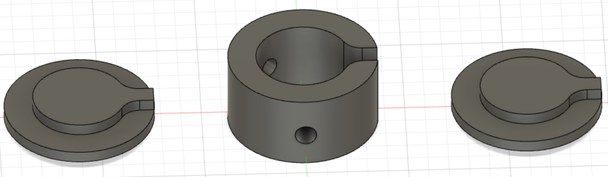

# OD_device_controls
This code is used to control an OD measuring device connected to a computer via a "ArduinoMega R3 Board 2560". The OD measuring device is used to measure the bacterial density of a batch culture that feeds a mother machine.
